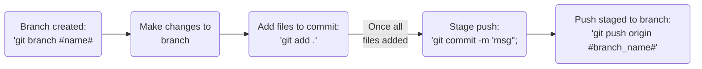

<p align="center">

</p>

# Ro's Sparring Grounds
This is Ro's holding repository for various scripts and examples for training.

## Git Workflows


## Lint code!
This repository utilizes ESList. To install the necessary dependencies, run the following command in the root where the repo was cloned:
```bash
npm i
```

Once installed, use `npx` to run the linter:
```bash
npx eslint
```

Ensure code is linted before submitting a PR!
