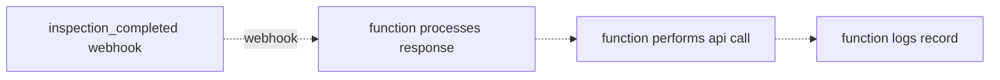

# Express App - Lock Record

This is a simple express POC that locks inspections upon completion on the SafetyCulture platform.

## Practical Technical Workflow:


## Cloud Env Considerations
While express apps can be run serverlessly in cloud providers, this is often not practical. That said, plugins are available to leverage express apps directly in the cloud provider of choice.

- Example:
```bash
npm install serverless-express
```
