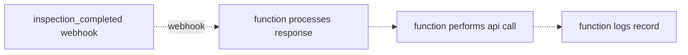

# Express App - Lock Record

This is a simple express POC that locks inspections upon completion on the SafetyCulture platform.

## Practical Technical Workflow:


## Cloud Env Considerations
Express apps can be run serverlessly using AWS Lambda or Azure Functions.

- AWS Lamba:
```bash
npm install aws-serverless-express
```

- Azure Functions:
```bash
npm install express @azure/functions
```
